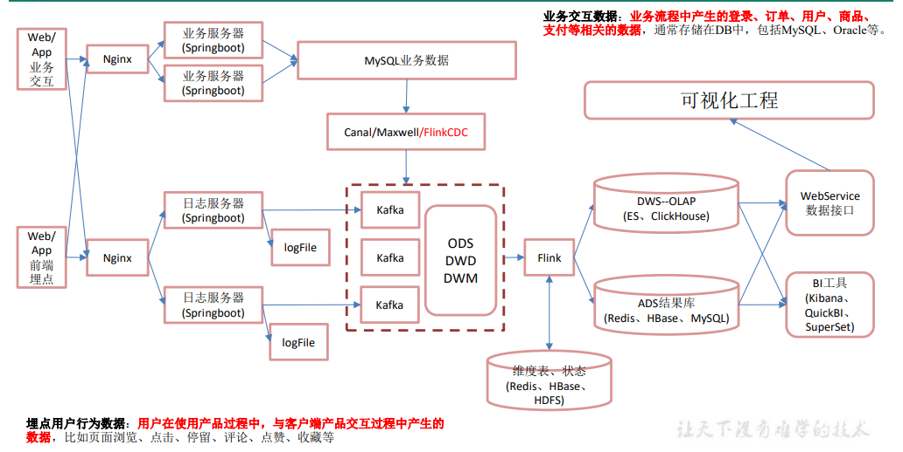
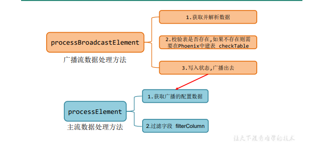

# Flink实时数仓
> 实时数仓基于一定的数据仓库理念，对数据处理流程进行规划、分层，目的是提高数据
的复用性。

## 概况

### 实时数仓分层

- ods：原始数据，日志和业务数据
- dwd：根据数据对象为单位进行分流，比如订单、页面访问等
- dim：维度数据
- dwm：对于部分数据对象进行进一步加工，比如独立访问、跳出行为，也可以和维度表进行关联，形成宽表，依旧是明细数据
- dws：根据某个主题将多个事实表数据轻度聚合，形成主题宽表
- ads：把ClickHouse中的数据根据可视化需要进行筛选聚合

### 实时架构

## 需求模块
> 开发全部基于Docker环境

### 日志数据采集(ods)

- [模拟日志生成器](source/mock_behavior)
  > 将日志发送到指定端口

- [日志采集](FlinkGmall2021/gmall-logger)

### 业务数据库采集(ods)

- [数据库环境配置](util/mysql)  
  1、导入建表数据  
  2、开启binlog
- [日志采集](FlinkGmall2021/gmall-flink-cdc)

### [用户行为日志(dwd)](FlinkGmall2021/gmall-realtime/src/main/scala/com/flink/app/dwd/BaseLogApp.scala)
- 识别新老用户
- 利用侧输出流实现数据拆分
- 将不同的流数据推送到kafka不同的topic

### [DB业务数据(dwd)](FlinkGmall2021/gmall-realtime/src/main/scala/com/flink/app/dwd/BaseDBApp.scala)
- FlinkCDC读取db数据进行etl处理
- 实现动态分流，将db数据动态拆分成事实表数据和维度表数据，采用mysql表存储相应的配置信息，并使用广播流
  
- 维度表数据保存到hbase，事实表数据保存到kafka

### [访客UV计算(dwm)](FlinkGmall2021/gmall-realtime/src/main/scala/com/flink/app/dwm/UniqueVisitApp.scala)
- 读取页面日志kafka数据
- 状态编程，保留每个用户第一次登录的记录，并设置状态ttl
- 过滤数据写入kafka

### [跳出明细计算(dwm)](FlinkGmall2021/gmall-realtime/src/main/scala/com/flink/app/dwm/UserJumpDetailApp.scala)
- 读取页面日志kafka数据
- 定义数据流watermark
- 定义模式序列，提取匹配数据和超时数据进行union
- 数据流写入kakfa

### [订单宽表(dwm)](FlinkGmall2021/gmall-realtime/src/main/scala/com/flink/app/dwm/OrderWideApp.scala)
- 定义合并之后的订单宽表实体类，包含事实数据和维度数据
- 订单流和订单明细流Join，这里选择intervalJoin(目前支持事件时间，所以需要指定watermark)
- 关联维表数据，封装[Jdbc工具类](FlinkGmall2021/gmall-realtime/src/main/java/com/flink/util/JdbcUtil.java)和[维表查询工具类](FlinkGmall2021/gmall-realtime/src/main/java/com/flink/util/DimUtil.java)
- 针对维表查询的两个优化：[旁路缓存(redis)](FlinkGmall2021/gmall-realtime/src/main/java/com/flink/util/RedisUtil.java)、[异步查询](FlinkGmall2021/gmall-realtime/src/main/java/com/flink/util/ThreadPoolUtil.java)
- 结果数据写入kafka